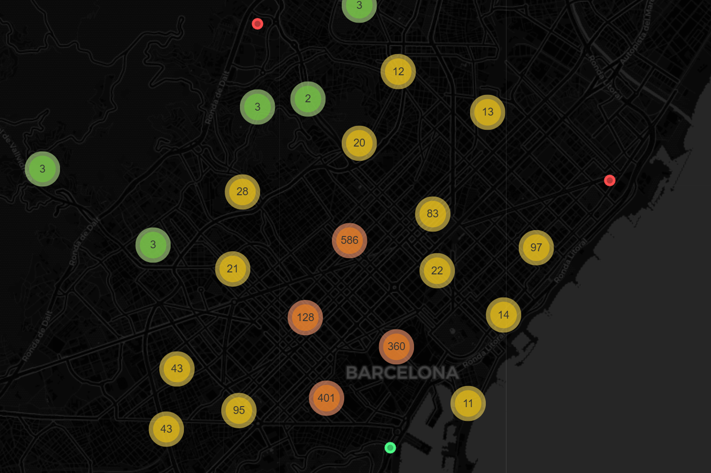
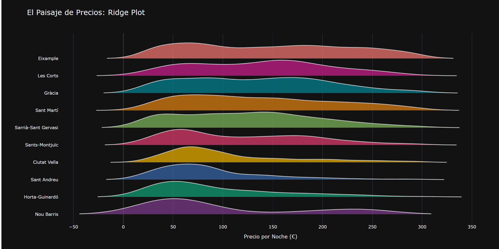
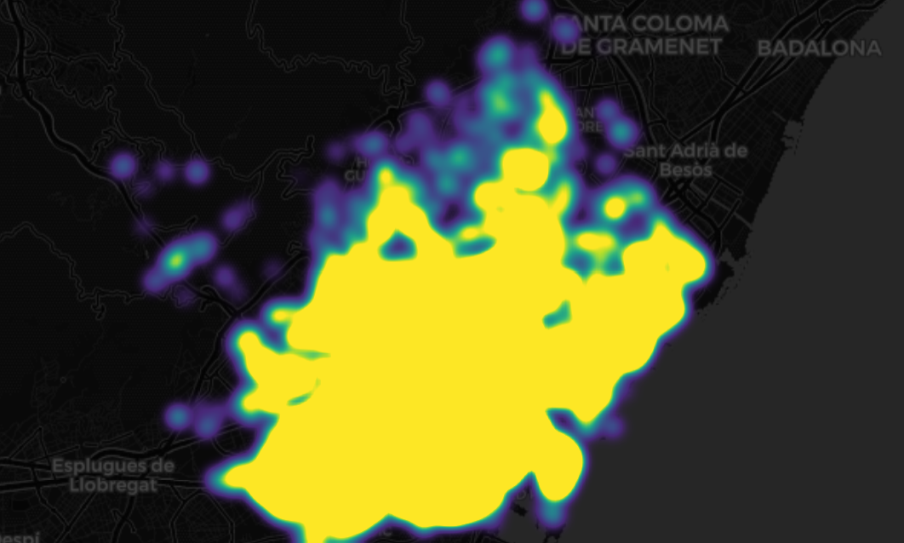
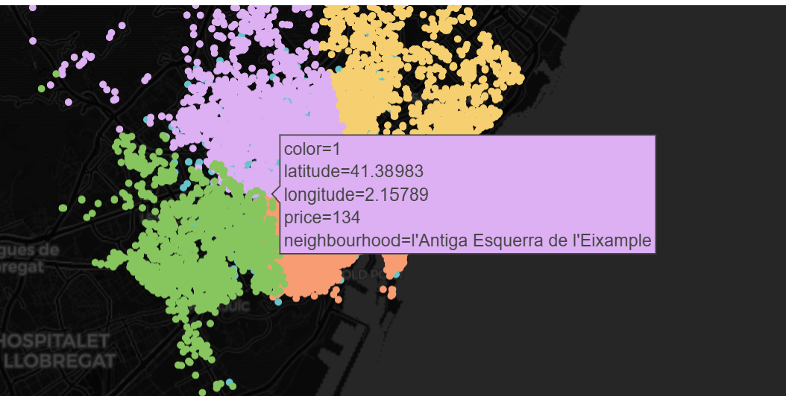
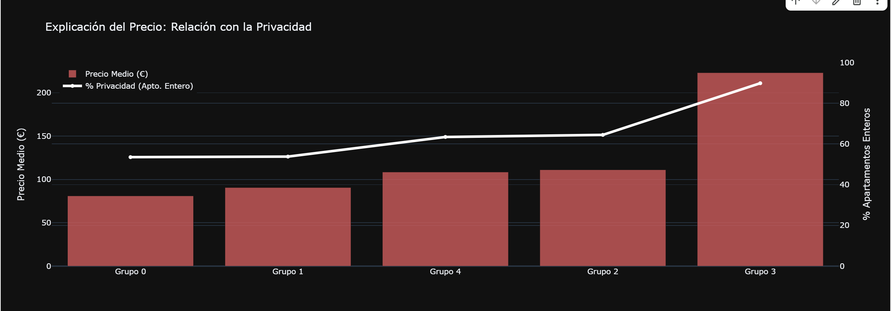

## Análisis de Airbnb en Barcelona

## Introducción y Objetivos
Este proyecto analiza el mercado de alquiler turístico en Barcelona para entender qué factores determinan el precio. Se busca responder si la ubicación o la privacidad son los elementos clave.

## Visualizaciones Clave
1. **Flujo de Mercado:** 
2. **Distribución (Ridge Plot):** 
3. **Densidad Hexagonal:** 
4. **Clusters IA (K-Means):** 
5. **Relación Precio-Privacidad:** 

## Conclusiones
He aprendido que el precio en Barcelona está fuertemente vinculado a la **privacidad** (apartamentos enteros vs habitaciones). El algoritmo de **K-Means** identificó con éxito las zonas "Premium" de la ciudad (Eixample y Ciutat Vella), donde el 90% de la oferta son viviendas completas.
